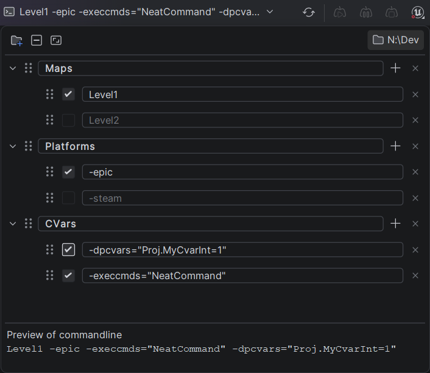

# ComplexArgs

A JetBrains Rider plugin for managing Unreal Engine commandline argument presets and injecting
them into C++ run configurations at launch.

Define arguments (e.g. `-server -log`, `MyMap_P`, `-execcmds="..."`), organise them into groups,
toggle them with checkboxes, and reorder them by drag-and-drop. Enabled entries are concatenated in
the order you tick them and appended to the selected run configuration's program parameters when you
launch.

## Requirements

- JDK 21 (any vendor) - Gradle selects it via toolchains and auto-provisions it if absent
- Gradle is provided by the wrapper (`gradlew`) - no manual install needed
- Target IDE: Rider 2026.1+ (build 261 and later)

## License

[Apache License 2.0](LICENSE)
